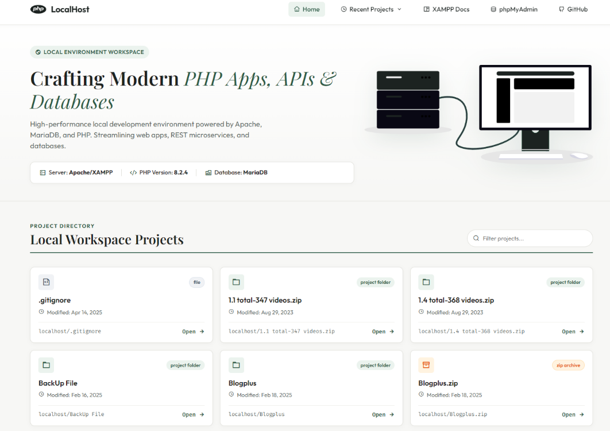

<p align="center">
  
</p>

<h1 align="center">XAMPP UI — Earthy Retro-Chic Developer Dashboard</h1>

<p align="center">
  <b>A modern, high-performance, open-source local workspace dashboard theme for XAMPP developers.</b>
  <br />
  Featuring an earthy minimalist design, dynamic project tracking, live search filtering, and animated SVG server graphics.
</p>

<p align="center">
  
</p>

<p align="center">
  <a href="#overview">Overview</a> •
  <a href="#key-features">Key Features</a> •
  <a href="#installation--usage">Installation</a> •
  <a href="#tech-stack--dependencies">Tech Stack</a> •
  <a href="#license">License</a> •
  <a href="#author--attribution">Author</a>
</p>

---

## Overview

**XAMPP UI** completely transforms the default XAMPP localhost index landing page into a stunning, production-grade developer workspace. Designed with inspiration from modern retro-chic aesthetics (EarthRise palette), it brings elegance and utility to your daily PHP, MySQL, and API development workflow.

---

## Key Features

- **Earthy Retro-Chic Aesthetic**: Curated color system featuring Deep Forest Green (`#2D5A46`), Warm Off-White Cream (`#F7F7F5`), Charcoal (`#1C2321`), and Google `Fira Code` Monospace typography.
- **5-Item Navigation Bar**:
  1. **Home**: Instant reset to main overview.
  2. **Recent Projects Dropdown**: Powered by JavaScript `localStorage` to automatically track and log your last 5 visited local projects with 1-click launch.
  3. **XAMPP Docs**: Fast link to local documentation (`/dashboard`).
  4. **phpMyAdmin**: One-click access to local database administration (`/phpmyadmin`).
  5. **GitHub**: Direct profile link.
- **Instant Client-Side Search**: Filter through dozens of local workspace projects in real-time.
- **Visual Badge Classification**:
  - **Project Folders**: Soft green badge (`#EBF3EE`).
  - **Archives & Databases** (`.zip`, `.sql`): Warm amber badge (`#FFF3E0`).
  - **Single Files**: Sleek slate badge (`#F0F2F5`).
- **Animated Inline Server SVG**: Interactive SVG illustration featuring glowing blade LEDs, animated wire data flows, and breathing database cylinders.
- **Built-in Developer Tools**: Direct footer links to inspect `phpinfo.php` configurations.

---

## Installation & Usage

Customizing your XAMPP dashboard takes less than 2 minutes!

### Step 1: Clone or Download the Repository

```bash
git clone https://github.com/timenyin/xammp-ui.git
```

### Step 2: Backup Your Existing XAMPP Index (Optional)

Navigate to your local XAMPP root directory (typically `C:\xampp\htdocs\`) and rename the default `index.php` to `index_backup.php`.

### Step 3: Copy Files to `htdocs`

Copy all files from this repository into your XAMPP `htdocs` directory:

- `index.php`
- `assets/` (containing `css/`, `js/`, `img/`, and `vendor/`)

### Step 4: Launch Localhost!

Open your browser and visit:

```http
http://localhost/
```

---

## Tech Stack & Dependencies

- **PHP**: Dynamic directory scanning and file metadata retrieval.
- **HTML5 & CSS3**: Custom CSS variables, keyframe animations, and flexbox/grid layouts.
- **JavaScript (ES6+)**: `localStorage` persistence, DOM event tracking, and live array filtering.
- **Bootstrap 5**: Responsive layout grid.
- **Remixicon & Bootstrap Icons**: Crisp vector icons.
- **Google Fonts**: `Outfit` (sans-serif), `Playfair Display` (editorial serif), and `Fira Code` (monospace).

---

## License

Distributed under the MIT License. See [`LICENSE`](LICENSE) for more information.

---

## Author & Attribution

Crafted by **Harmony**

- **GitHub**: [@timenyin](https://github.com/timenyin)

<br />

<p align="center">
    
</p>

<p align="center">
  <sub>Happy Coding!</sub>
</p>
